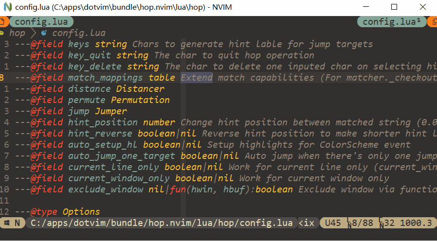
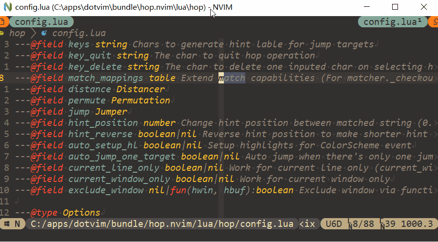
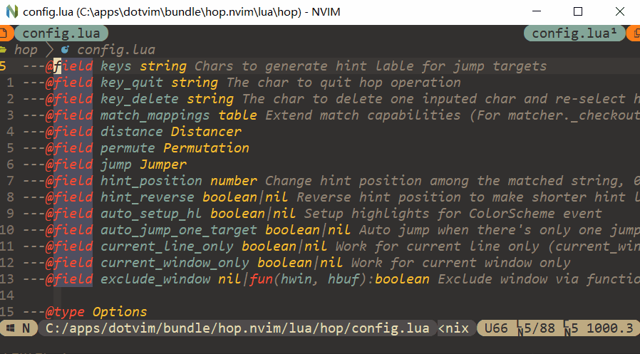
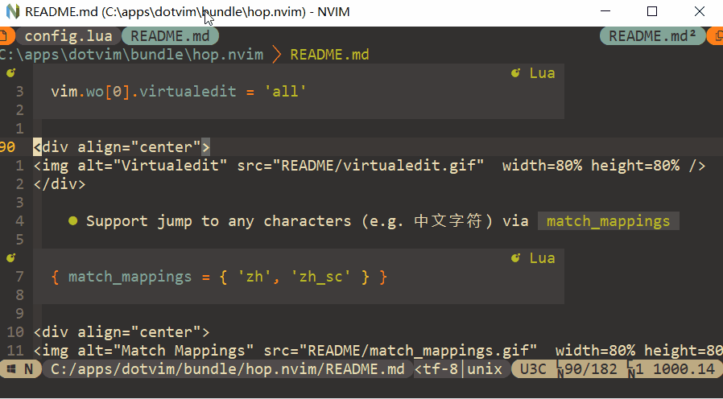

                                              __
                                             / /_  ____  ____
                                            / __ \/ __ \/ __ \
                                           / / / / /_/ / /_/ /
                                          /_/ /_/\____/ .___/
                                                     /_/
                                      · Neovim motions on speed! ·

A fork & rewrite of [hop.nvim](https://github.com/phaazon/hop.nvim).

# Requirements

- Neovim >= 0.9.0


# Setup

Install with e.g. lazy.nvim:

```lua
-- default configs
{
    'yehuohan/hop.nvim',
    --- @see require('hop.config').Options
    opts = {
        --- Chars to generate hint lable for jump targets
        keys = 'asdghklqwertyuiopzxcvbnmfj',

        --- The char to quit hop operation
        key_quit = '<Esc>',

        --- The char to delete one inputed char and re-select hint lable for jump targets
        key_delete = '<Bs>',

        --- Extend match capabilities (For matcher.checkout_mappings and matcher.chars)
        --- Currently supported: { "noshift", "zh", "zh_sc", "zh_tc", "fa" }
        --- e.g. "noshift" can jump to '@' by typing '2', jump to '#' by typing '3', and so on
        match_mappings = {},

        --- Compute distance between cursors
        --- @see require('hop.window').Cursor
        --- fun(a:Cursor, b:Cursor):number
        distance = require('hop.hinter').manhattan,

        --- Generate permutations from Options.keys
        --- fun(keys:string, n:integer):string[][]
        permute = require('hop.permutation').permute,

        --- Operation on the jump target
        --- @see require('hop.config').Options
        --- @see require('hop.hinter').JumpTarget
        --- fun(jump_target:JumpTarget, opts:Options)
        jump = require('hop.jumper').move_cursor,

        --- Hint direction, nil means hint all directions
        --- @see require('hop.config').HintDirection
        --- Support: HintDirection.BEFORE_CURSOR, HintDirection.AFTER_CURSOR
        hint_direction = nil,

        --- Change hint position among the matched string, 0.0 for left and 1.0 for right
        hint_position = 0.0,

        --- Reverse hint position to make shorter hint lables placed further
        hint_reverse = false,

        --- Display hint keys in upper
        hint_upper = false,

        --- Highlight the matched string
        --- e.g. highlight the matched word with hop.word
        hl_matched = false,

        --- Highlight the unmatched part of the buffer (i.e. highlight the background)
        hl_unmatched = true,

        --- Setup highlights for ColorScheme event
        auto_setup_hl = true,

        --- Auto jump when there's only one jump target
        auto_jump_one_target = true,

        --- Work for current cursor line only
        current_line_only = false,

        --- Work for current window only
        current_window_only = false,

        --- Exclude buffer line from hop operations (folded means take an empty string as a folded line)
        --- e.g. when exclude folded line, hop.line_start can't jump to the start of folded line
        --- @see require('hop.window').WindowRow
        --- nil|fun(hwin, hbuf, lnum:WindowRow, folded:boolean):boolean
        exclude_line = nil,

        --- Exclude window from hop operations
        --- nil|fun(hwin, hbuf):boolean
        exclude_window = nil,

        --- Show message when there's no jump targets
        --- string|func():string
        msg_no_targets = 'No target was found...',
    }
}
```


# Features

- Support re-selecting jump target via `opts.key_delete`

```lua
{ key_delete = '<Bs>' }
```

<div align="center">

</div>

- Support `virtualedit`

```lua
vim.wo[0].virtualedit = 'all'
```

<div align="center">

</div>

- Support [multicursor.nvim](https://github.com/jake-stewart/multicursor.nvim)

```lua
local mc = require('multicursor-nvim')
mc.addKeymapLayer(function(lyr)
    local hop = require('hop')
    local move_mc = require('hop.jumper').move_multicursor
    lyr({ 'n', 'x' }, 's', function() hop.char({ jump = move_mc }) end)
    lyr({ 'n', 'x' }, 'f', function() hop.anywhere({ jump = move_mc, current_line_only = true }) end)
    lyr({ 'n', 'x' }, '<leader>j', function() hop.vertical({ jump = move_mc }) end)
    end)
end)
```

<div align="center">

</div>

- Support jump to any type characters (e.g. 中文字符) via `opts.match_mappings` and `HopChar`

```lua
{ match_mappings = { 'zh', 'zh_sc' } }
```

<div align="center">

</div>

- Very very very fast permutation algorithm (see [permutation.lua](./lua/hop/permutation.lua) and [benchmarks.lua](./tests/benchmarks.lua))

- Create/extend hop operations very easily (see [Custom operations](#custom-operations))


# Custom Operations

- Pick & jump to a target window with `require('hop').wrap`

```lua
local function hop_pick_window()
    local hop = require('hop')
    local hop_win = require('hop.window')

    hop.wrap(
        ---@see require('hop.matcher').Matcher
        {
            oneshot = true,
            match = function(_, wctx, lctx)
                if hop_win.is_cursor_line(wctx, lctx) then
                    local jt = wctx.cursor
                    return { b = jt.col, e = jt.col, off = jt.off, virt = jt.virt }
                end
            end,
        },
        ---@see require('hop.config').Options
        {
            keys = 'fdsjklaweriop',
            hint_upper = true,
            auto_jump_one_target = false,
            ---@see require('hop.jumper').Jumper
            jump = function(jt, opts)
                if vim.api.nvim_win_is_valid(jt.window) then
                    vim.api.nvim_set_current_win(jt.window)
                end
            end,
            msg_no_targets = function() vim.notify('There’s only one window', vim.log.levels.ERROR) end,
        }
    )
end
```

- Search target pattern dynamically with `require('hop.hinter')`

```lua
local function hop_pattern()
    local hop = require('hop')
    local hinter = require('hop.hinter')
    local matcher = require('hop.matcher')

    local opts = hop.get_opts()
    opts.hl_matched = true -- Highlight matched pattern

    ---@see hinter.Hinter
    local ht = hinter.new(opts) -- Create a hinter
    ht:render_areas()

    local jts
    local got = ''
    while true do
        hop.echo('Hop char:' .. got, 'inp')
        local ok, c = pcall(vim.fn.getcharstr)
        if (not ok) or (c == opts.key_quit) then
            ht:clear_state()
            return
        elseif c == vim.api.nvim_replace_termcodes('<CR>', true, false, true) then
            ht:render_jumps(nil) -- Clear extmarks of jump targets
            break
        elseif c == opts.key_delete then
            got = got:sub(1, #got - 1)
        else
            got = got .. c
        end

        ---@see hinter.JumpTarget[]
        jts = ht:collect(matcher.chars(got, false, opts.match_mappings)) -- Collect jump targets
        ht:render_jumps(jts)
    end

    -----------------------------------------------------------
    -- Perform more processing on all matched jump targets here
    -----------------------------------------------------------

    opts.hl_matched = false -- Disable highlighting matched pattern

    local jt = ht:select(jts) -- Select one jump target
    if jt then
        -----------------------------------------------------------
        -- Perform more processing on the selected jump target here
        -----------------------------------------------------------
        opts.jump(jt, opts) -- Jump to selected jump target
    end
end
```


# Builtin Operations

All operations from `hop = require('hop')` accept `require('hop.config').Options` to override global options,
and support motion and operator command, e.g. `vim.keymap.set('o', 's', '<Cmd>HopChar<CR>')`.

- `:HopChar`, `hop.char(opts)`: Jump to an any character
- `:HopWord`, `hop.word(opts)`: Jump to an any word start
- `:HopAnywhere`, `hop.anywhere(opts)`: Jump to anywhere
- `:HopLineStart`, `hop.line_start(opts)`: Jump to any line start with whitespace characters skipped
- `:HopVertical`, `hop.vertical(opts)`: Jump the any line with cursor column

> * `:Hop<xxx>` means `{ hint_direction = nil, current_line_only = false, current_window_only = false }`
> * `:Hop<xxx>CL` means `{ hint_direction = nil, current_line_only = true, current_window_only = true }`
> * `:Hop<xxx>CW` means `{ hint_direction = nil, current_line_only = false, current_window_only = true }`
> * `:Hop<xxx>AC` means `{ hint_direction = AFTER_CURSOR, current_line_only = false, current_window_only = true }`
> * `:Hop<xxx>ACCL` means `{ hint_direction = AFTER_CURSOR, current_line_only = true, current_window_only = true }`
> * `:Hop<xxx>BC` means `{ hint_direction = BEFORE_CURSOR, current_line_only = false, current_window_only = true }`
> * `:Hop<xxx>BCCL` means `{ hint_direction = BEFORE_CURSOR, current_line_only = true, current_window_only = true }`


# Highlights

- `HopNextKey`: Highlight the mono-sequence keys (i.e. sequence of 1)
- `HopNextKey1`: Highlight the first key in a sequence
- `HopNextKey2`: Highlight the second and remaining keys in a sequence
- `HopMatched`: Highlight the matched string (e.g. highlight the matched word with hop.word)
- `HopUnmatched`: Highlight the unmatched part of the buffer (i.e. highlight the background)

# Thanks

Thanks [phaazon/hop.nvim](https://github.com/phaazon/hop.nvim) and [smoka7/hop.nvim](https://github.com/smoka7/hop.nvim)
